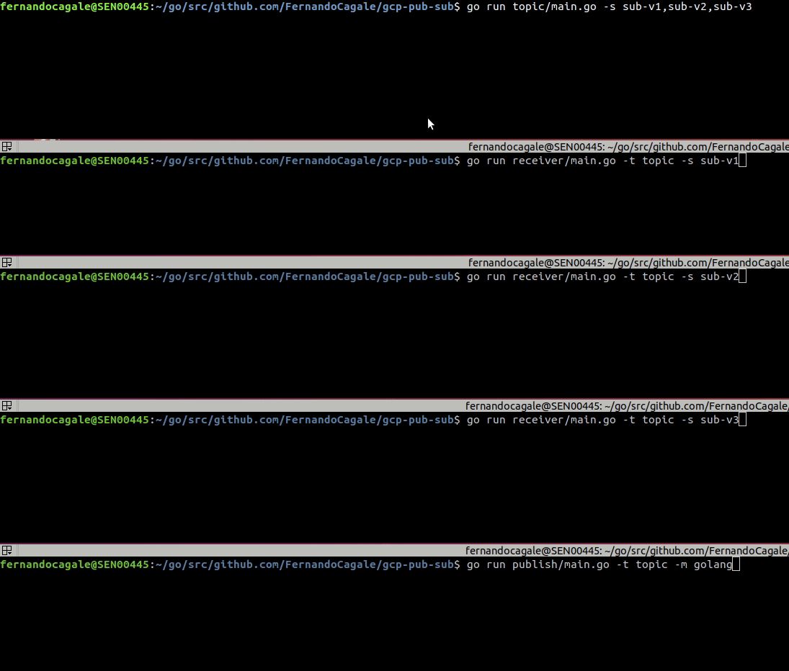

## GCP Pub/Sub

####Go Mod

   * Download dependencies
     
```shell script
$ go mod download
```

   * Vendor local
   
```shell script
$ go mod vendor
```   

## Configurable environment variables LOCAL

   * Rename file `.envsample` to `.env`

```sh
$ cp .envsample .env
```

| Name                    	| Required                    	| Description                                                                                                                      	|
|-------------------------	|-----------------------------	|----------------------------------------------------------------------------------------------------------------------------------	|
| KEY                     	| TRUE                       	| File private key GCP                                                                                                           	|
| PROJECT  	                | TRUE                       	| Name project GCP                                                                                                                  |

## Example

   * Create `topic` and `subscription`  

```sh
$   go run topic/main.go -s sub-v1,sub-v2,sub-v3
$   2020/07/14 13:09:03 Topic created:  topic
$   2020/07/14 13:09:07 Subscription created:  sub-v1
$   2020/07/14 13:09:13 Subscription created:  sub-v2
$   2020/07/14 13:09:17 Subscription created:  sub-v3
```

   *  Publish

```sh   
$   go run publish/main.go -t topic -m golang
```

   *  Receiver-v1

```sh   
$   go run receiver/main.go -t topic -s sub-v1
$   2020/07/14 13:30:33 Subscription sub-v1 Got message: "golang"
```

   *  Receiver-v2

```sh   
$   go run receiver/main.go -t topic -s sub-v2
$   2020/07/14 13:30:33 Subscription sub-v2 Got message: "golang"
```

   *  Receiver-v3

```sh   
$   go run receiver/main.go -t topic -s sub-v3
$   2020/07/14 13:30:33 Subscription sub-v3 Got message: "golang"
```

